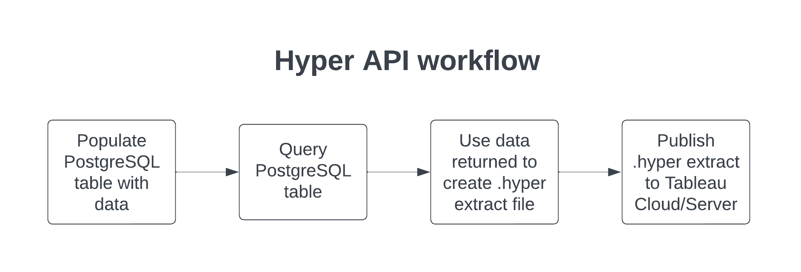
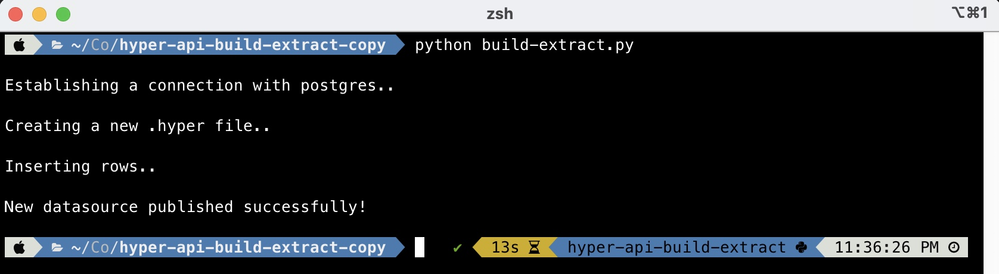

<h1>Generating Tableau extracts programatically</h1>

 

This code example uses Tableau APIs to illustrate how to accomplish the following:
1. Fetch data from a PostgreSQL table
2. Generate a .hyper file
3. Publish the .hyper file to Tableau Cloud/Server

Creating extracts programatically is a requirement that manifests itself into many real-world use-cases. Tableau customers continue to need automation capabilities as their business & security requirements evolve.

For example, a business may wish to allow external users the ability to upload data to an external-facing web application (customer portal/partner app/etc.) they manage and make that data available in Tableau Embedded Analytics for consumption seamlessly without forcing the end user to toggle between multiple applications.

Or another example, many Embedded Analytics scenarios involve Single Tenant data architectures where each customer/client/tenant's data is stored in its own data store/set of database tables, aka physical or logical partitioning. You will need a mechanism to take each tenant's data and publish it for use in Tableau and update it as the source data changes. One way to accomplish this is to take advantage of Tableau's hyper fast SQL engine and APIs.

 

 

 

At a high level, you will need to run through the following steps:
<ol>
    <li>Install all dependencies including PostgreSQL, psycopg2, Tableau Hyper API, Tableau Server Client</li>
    <li>Create a database in PostgreSQL & import <i>Superstore.csv</i> into a database table named "Superstore"</li>
    <li>Create a database user and asign them reading permissions on the database table</li>
    <li>Generate a Tableau Personal Access Token</li>
    <li>Make code edits to the <i>build-extract.py</i> file in the following places (enter your information):</li>
        <ul>
            <li>line 15 - database name</li>
            <li>line 15 - database username</li>
            <li>line 15 - database password</li>
            <li>line 85 - tableau personal access token name</li>
            <li>line 85 - tableau personal access token secret</li>
            <li>line 85 - tableau server/cloud site name</li>
            <li>line 86 - tableau server/cloud domain</li>
            <li>line 96 - tableau project name</li>
        </ul>
</ol>

 

<b>IMPORTANT: The code provided in this repository is by no means production-ready code and is only intended to be used for testing/demo purposes.</b>
